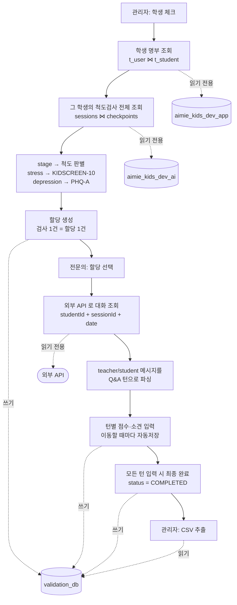

# Test_validation_doctor

AIMIE Kids 하루톡 대화에 대한 **전문의 평가 시스템** (Streamlit + PostgreSQL).

관리자가 전문의에게 학생/세션 평가를 할당하고, 전문의가 Q&A 턴 단위로 점수·소견을
입력하며, 완료된 평가를 CSV 로 추출한다.

## 아키텍처

데이터 출처가 셋으로 나뉜다. **읽기 전용 소스 2개 + 외부 API 1개**에서 재료를 모아,
이 시스템이 만들어내는 결과는 전부 신규 DB 하나에만 쌓는다.

| 출처 | 무엇을 | 접근 |
| --- | --- | --- |
| `aimie_kids_dev_app` | 학생 명부 | 읽기 전용 (`STUDENT_SOURCE_DATABASE_URL`) |
| `aimie_kids_dev_ai` | 척도검사 목록 · 어떤 척도였는지 | 읽기 전용 (`SESSION_SOURCE_DATABASE_URL`) |
| 외부 API | 하루톡 대화 본문 | 읽기 전용 (`EXTERNAL_API_BASE_URL`) |
| **`validation_db`** | 계정 · 할당 · 평가 결과 | **읽기/쓰기** |

두 DB 조회는 커넥션이 `read_only` 로 열려 쓰기 쿼리가 DB 단계에서 거부된다.
접근 지점도 `app/student_directory.py` / `app/session_directory.py` 두 곳뿐이라,
인스턴스 DB 로 옮길 때는 접속 문자열과 그 파일의 쿼리 상수만 바꾸면 된다.

### 데이터 관계도

세 곳의 데이터를 **학생 UUID** 와 **세션 키**로 이어 붙인다.
DB 가 서로 달라 물리적 외래키는 걸 수 없고, 아래 점선이 논리적 참조다.


**연결 고리는 `user_uuid` 하나다.** `t_user.user_uuid` = `sessions.user_id` = 외부 API 의
`studentId` 가 모두 같은 32자 값이라 세 곳을 이어붙일 수 있다.
`sessions` 는 `(user_id, date, session_id)` 복합키이고, `checkpoints` 가 같은 키로 1:1 대응한다.

### 데이터 흐름



핵심은 **관리자가 날짜도 척도도 입력하지 않는다**는 점이다.
학생만 고르면 검사 목록과 각 검사의 날짜·척도가 DB 에서 따라온다.

## 빠른 시작

```bash
# 1) DB 컨테이너 기동
docker compose up -d test-db

# 2) 평가용 데이터베이스 생성 (최초 1회)
docker exec local-postgres psql -U aimieapi -d postgres -c "CREATE DATABASE validation_db"

# 3) 환경변수 준비
cp .env.example .env   # 외부 API 계정(EXTERNAL_API_LOGIN_ID/PASSWORD)을 채운다

# 4) 의존성 설치 + 스키마 + 데모 계정
uv sync
uv run python -m scripts.init_db --seed

# 5) 외부 API 연동 점검 (로그인 → 대화 조회 → 턴 파싱)
uv run python -m scripts.check_api --student <studentId> --date 26.08.31

# 6) 앱 실행
uv run streamlit run Test_validation_doctor.py
```

### 외부 API 접속 정보

| 항목 | 값 |
| --- | --- |
| 호스트 | `https://admin-dev.aimie-m.com` |
| 로그인 | `POST /api-kids/adm/login` (`loginType: TEACHER`) |
| 대화 조회 | `GET /api-kids/risk-students/student/chat` (Bearer 토큰) |

앱은 토큰이 없으면 `.env` 의 `EXTERNAL_API_LOGIN_ID` / `EXTERNAL_API_PASSWORD` 로
자동 로그인해 `accessToken` 을 받아 사용한다.
게이트웨이 프리픽스가 바뀌면 `EXTERNAL_API_LOGIN_PATH` / `EXTERNAL_API_CHAT_PATH` 로 조정한다.

> `dev.aimie-m.com` 은 nginx 테스트 페이지만 떠 있어 모든 API 경로가 404 다. `admin-dev` 를 쓸 것.

데모 계정: `admin / admin1234`, `doctor01~03 / doctor1234`
(비밀번호는 `.env` 의 `SEED_ADMIN_PASSWORD`, `SEED_DOCTOR_PASSWORD` 로 바꿀 수 있다.)

## 테스트

```bash
uv run pytest                # 전체
uv run pytest -m "not db"    # DB 없이 순수 로직만
```

DB 테스트는 실제 `validation_db` 에 붙어 트랜잭션 롤백으로 격리한다.
컨테이너가 꺼져 있으면 안내 메시지와 함께 실패한다.

## 구조

| 경로 | 역할 |
| --- | --- |
| `Test_validation_doctor.py` | Streamlit 진입점 (로그인 → 역할별 화면 라우팅) |
| `app/parsing.py` | 외부 API 메시지 → Q&A 턴 파싱 (순수 함수) |
| `app/external_api.py` | 외부 대화 API 클라이언트 (Read-only) |
| `app/student_directory.py` | 학생 명부 조회 (학생 DB, Read-only) |
| `app/session_directory.py` | 척도검사 목록 조회 (세션 DB, Read-only) |
| `app/repositories/` | SQL 접근 계층 (커밋하지 않음) |
| `app/services/` | SPEC §6 API 컨트롤러에 대응하는 서비스 함수 |
| `app/ui/` | 로그인 / 관리자 / 전문의 화면 |
| `sql/` | 스키마 마이그레이션 (멱등) |
| `scripts/init_db.py` | 스키마 생성 + 데모 계정 시드 |

## 척도와 점수

관리자가 척도를 고르지 않는다. AI 대화 엔진이 세션마다 남기는
`checkpoints.channel_values.stage` 를 읽어 척도를 판별하고, 할당의
`scale_stage` 에 저장해 전문의 화면의 기본값으로 쓴다 (전문의가 바꿀 수 있다).

| 대화 엔진 stage | 척도 | 근거 (scores 세부 문항) |
| --- | --- | --- |
| `stress` | 1단계 KIDSCREEN-10 | felt_sad, felt_lonely, got_on_well_at_school … |
| `depression` | 3단계 PHQ-A | PHQ-9 문항 9개 |
| `opening` `finish` `continue` | (판별 안 함) | 척도가 아니라 진행 상태 |

점수 선택지는 척도마다 다르다.

| 척도 | 선택지 |
| --- | --- |
| KIDSCREEN-10 | Never (1점) ~ Extremely (5점) |
| 그 외 (PHQ 계열) | Not at all (0점) ~ Extremely (4점) — `DOCTOR_SCORE_OPTIONS` |

매핑은 `app/config.py` 의 `DEFAULT_STAGE_TO_SCALE` / `SCALE_SCORE_OPTIONS` 에서 바꾼다.

---

## stg 배포

**코드만 올려서는 뜨지 않는다.** DB 주소 외에도 아래가 필요하다.

### 1. 사전 준비 (한 번만)

```bash
# 1) 런타임
#    Python 3.11+, uv 설치.  uv sync 로 의존성 설치 (uv.lock 그대로 재현)
uv sync --frozen

# 2) 평가 DB 생성 — 이 시스템 전용 신규 DB 다. 기존 DB 를 재사용하지 않는다.
psql -h <stg-db-host> -U <admin> -c "CREATE DATABASE validation_db"

# 3) 스키마 + 계정
uv run python -m scripts.init_db --seed
```

`scripts/init_db.py` 는 `sql/*.sql` 을 순서대로 실행한다. 전부 멱등이라
배포할 때마다 그냥 다시 돌리면 된다 (스키마 변경 반영 포함).

### 2. 환경변수 — DB 주소만 바꾸면 되는 게 아니다

| 변수 | stg 에서 바꿔야 하나 | 비고 |
| --- | --- | --- |
| `VALIDATION_DATABASE_URL` | ✅ | **DB 를 새로 만들어야 한다.** 주소만 바꾸면 빈 DB 라 뜨지 않음 |
| `STUDENT_SOURCE_DATABASE_URL` | ✅ | stg 학생 DB. **읽기 전용 계정**을 따로 발급받을 것 |
| `SESSION_SOURCE_DATABASE_URL` | ✅ | stg 세션 DB (척도검사 목록) |
| `EXTERNAL_API_BASE_URL` | ✅ | stg API 주소 |
| `EXTERNAL_API_LOGIN_ID` / `_PASSWORD` | ✅ | stg 계정 |
| `EXTERNAL_API_LOGIN_PATH` / `_CHAT_PATH` | 환경에 따라 | 게이트웨이 프리픽스가 다르면 |
| `SEED_ADMIN_PASSWORD` / `SEED_DOCTOR_PASSWORD` | ✅ | **데모 비밀번호 그대로 두면 안 된다** |
| `DOCTOR_SCORE_OPTIONS` / `SCALE_STAGE_OPTIONS` | 선택 | 척도 표기를 바꿀 때만 |

`.env` 는 커밋되지 않으므로 배포 대상 서버에서 직접 만든다 (`cp .env.example .env`).
파일 권한은 `chmod 600` 으로 좁힌다.

### 3. 네트워크 도달성

앱이 붙는 곳이 4군데다. 방화벽/보안그룹에서 전부 열려 있어야 한다.

```
Streamlit ─┬─→ validation_db          (읽기/쓰기)
           ├─→ 학생 DB                 (읽기 전용)
           ├─→ 세션 DB                 (읽기 전용)
           └─→ 외부 API (HTTPS)        (읽기 전용)
```

### 4. 상시 구동

`streamlit run` 은 포그라운드 프로세스다. systemd 나 컨테이너로 감싼다.

```bash
uv run streamlit run Test_validation_doctor.py \
  --server.port 8501 \
  --server.address 0.0.0.0 \
  --server.headless true
```

앞단에 nginx 를 두고 **HTTPS 로 종단**한다. 로그인 비밀번호가 평문으로 오가면 안 된다.
WebSocket 을 쓰므로 프록시 설정에 `Upgrade` / `Connection` 헤더가 필요하다.

```nginx
location / {
    proxy_pass http://127.0.0.1:8501;
    proxy_http_version 1.1;
    proxy_set_header Upgrade    $http_upgrade;
    proxy_set_header Connection "upgrade";
    proxy_set_header Host       $host;
}
```

서브경로(`/validation/`)로 붙일 경우 `--server.baseUrlPath validation` 를 함께 준다.

### 5. 배포 전 확인

```bash
uv run python -m scripts.check_api --student <studentId> --date 26.08.31  # 외부 API
uv run pytest -m "not db"                                                 # 순수 로직
uv run pytest                                                             # DB 포함 전체
```

### 6. 알려진 제약 (배포 전에 판단할 것)

- **로그인 시도 제한이 없다.** 계정 잠금·지연이 구현되어 있지 않으므로,
  외부에 열 거라면 VPN/IP 제한 뒤에 두는 편이 안전하다.
- **계정 관리 화면이 없다.** 전문의 계정은 `scripts/init_db.py --seed`
  (`SEED_DOCTOR_COUNT`) 로만 만들 수 있고 비밀번호가 전원 동일하다.
- **Streamlit 단일 프로세스**다. 동시 접속자가 많으면 CPU 1코어에 묶인다.
  전문의 10명 수준이면 문제없지만, 그 이상이면 워커를 늘리는 구조가 필요하다.
- **감사 로그가 없다.** 누가 언제 평가를 바꿨는지는 `updated_at` 뿐이다.

---

자세한 기능 명세는 `SPEC.md`, 작업 규칙은 `CLAUDE.md` 참고.
