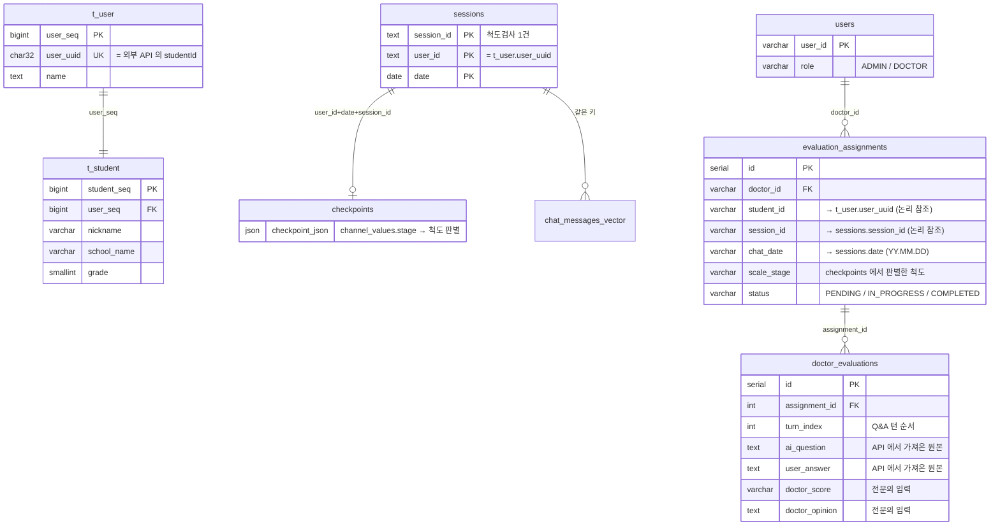
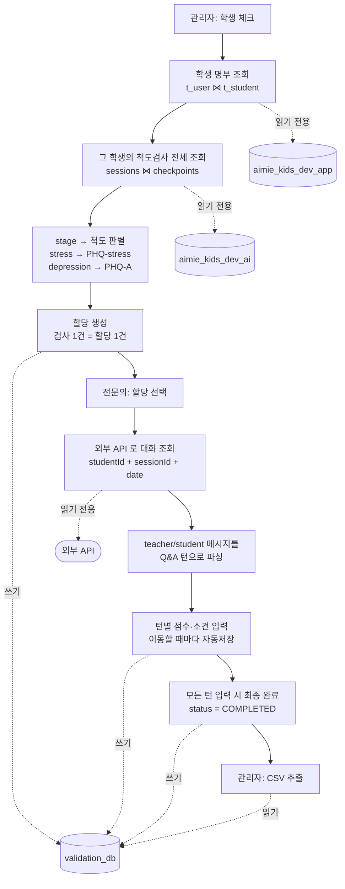

# Test_validation_doctor

AIMIE Kids 하루톡 대화에 대한 **전문의 평가 시스템** (Streamlit + PostgreSQL).

관리자가 전문의에게 학생/세션 평가를 할당하고, 전문의가 Q&A 턴 단위로 점수·소견을
입력하며, 완료된 평가를 CSV 로 추출한다.

## 아키텍처

데이터 출처가 셋으로 나뉜다. **읽기 전용 소스 2개 + 외부 API 1개**에서 재료를 모아,
이 시스템이 만들어내는 결과는 전부 신규 DB 하나에만 쌓는다.

| 출처 | 무엇을 | 접근 |
| --- | --- | --- |
| `aimie_kids_dev_app` | 학생 명부 | 읽기 전용 (`STUDENT_SOURCE_DATABASE_URL`) |
| `aimie_kids_dev_ai` | 척도검사 목록 · 어떤 척도였는지 | 읽기 전용 (`SESSION_SOURCE_DATABASE_URL`) |
| 외부 API | 하루톡 대화 본문 | 읽기 전용 (`EXTERNAL_API_BASE_URL`) |
| **`validation_db`** | 계정 · 할당 · 평가 결과 | **읽기/쓰기** |

서버에서는 세 DB 의 접속 정보를 `.env` 가 아니라 **AWS SSM** 에서 가져온다 (`SECRETS_BACKEND=aws`). 배포 §5-A 참고.

두 DB 조회는 커넥션이 `read_only` 로 열려 쓰기 쿼리가 DB 단계에서 거부된다.
접근 지점도 `app/student_directory.py` / `app/session_directory.py` 두 곳뿐이라,
인스턴스 DB 로 옮길 때는 접속 문자열과 그 파일의 쿼리 상수만 바꾸면 된다.

### 데이터 관계도

세 곳의 데이터를 **학생 UUID** 와 **세션 키**로 이어 붙인다.
DB 가 서로 달라 물리적 외래키는 걸 수 없고, 아래 점선이 논리적 참조다.



**연결 고리는 `user_uuid` 하나다.** `t_user.user_uuid` = `sessions.user_id` = 외부 API 의
`studentId` 가 모두 같은 32자 값이라 세 곳을 이어붙일 수 있다.
`sessions` 는 `(user_id, date, session_id)` 복합키이고, `checkpoints` 가 같은 키로 1:1 대응한다.

### 데이터 흐름



핵심은 **관리자가 날짜도 척도도 입력하지 않는다**는 점이다.
학생만 고르면 검사 목록과 각 검사의 날짜·척도가 DB 에서 따라온다.

## 빠른 시작

```bash
# 1) DB 컨테이너 기동
docker compose up -d test-db

# 2) 평가용 데이터베이스 생성 (최초 1회)
docker exec local-postgres psql -U aimieapi -d postgres -c "CREATE DATABASE validation_db"

# 3) 환경변수 준비
cp .env.example .env   # 외부 API 계정(EXTERNAL_API_LOGIN_ID/PASSWORD)을 채운다

# 4) 의존성 설치 + 스키마 + 데모 계정
uv sync
uv run python -m scripts.init_db --seed

# 5) 외부 API 연동 점검 (로그인 → 대화 조회 → 턴 파싱)
uv run python -m scripts.check_api --student <studentId> --date 26.08.31

# 6) 배포 전 점검 (설정·DB·API·정합성 한 번에)
uv run python -m scripts.preflight

# 7) 앱 실행 (서버는 8002, 로컬은 아무 포트나)
uv run streamlit run Test_validation_doctor.py --server.port 8002
```

### 외부 API 접속 정보

| 항목 | 값 |
| --- | --- |
| 호스트 | `https://admin-dev.aimie-m.com` |
| 로그인 | `POST /api-kids/adm/login` (`loginType: TEACHER`) |
| 대화 조회 | `GET /api-kids/risk-students/student/chat` (Bearer 토큰) |

앱은 토큰이 없으면 `.env` 의 `EXTERNAL_API_LOGIN_ID` / `EXTERNAL_API_PASSWORD` 로
자동 로그인해 `accessToken` 을 받아 사용한다.
게이트웨이 프리픽스가 바뀌면 `EXTERNAL_API_LOGIN_PATH` / `EXTERNAL_API_CHAT_PATH` 로 조정한다.

> `dev.aimie-m.com` 은 nginx 테스트 페이지만 떠 있어 모든 API 경로가 404 다. `admin-dev` 를 쓸 것.

계정: `admin`, `doctor01~03`. **비밀번호는 `init_db --seed` 가 난수로 발급해
화면에 한 번만 출력한다** — 그때 받아 적을 것. 자세한 내용은 아래 배포 §7 참고.
로컬 개발에서만 `SEED_ADMIN_PASSWORD` / `SEED_DOCTOR_PASSWORD` 로 고정할 수 있다.

## 테스트

```bash
uv run pytest                # 전체
uv run pytest -m "not db"    # DB 없이 순수 로직만
```

DB 테스트는 실제 `validation_db` 에 붙어 트랜잭션 롤백으로 격리한다.
컨테이너가 꺼져 있으면 안내 메시지와 함께 실패한다.

## 구조

| 경로 | 역할 |
| --- | --- |
| `Test_validation_doctor.py` | Streamlit 진입점 (로그인 → 역할별 화면 라우팅) |
| `app/parsing.py` | 외부 API 메시지 → Q&A 턴 파싱 (순수 함수) |
| `app/external_api.py` | 외부 대화 API 클라이언트 (Read-only) |
| `app/student_directory.py` | 학생 명부 조회 (학생 DB, Read-only) |
| `app/session_directory.py` | 척도검사 목록 조회 (세션 DB, Read-only) |
| `app/repositories/` | SQL 접근 계층 (커밋하지 않음) |
| `app/services/` | SPEC §6 API 컨트롤러에 대응하는 서비스 함수 |
| `app/ui/` | 로그인 / 관리자 / 전문의 화면 |
| `sql/` | 스키마 마이그레이션 (멱등) |
| `scripts/init_db.py` | 스키마 생성 + 데모 계정 시드 |
| `scripts/preflight.py` | 배포 전 점검 (실패 시 종료 코드 1) |
| `app/preflight.py` | 점검 판정 로직 (순수 함수) |
| `app/secret_loader.py` | AWS SSM 에서 DB 접속 정보 조회 (`SECRETS_BACKEND=aws`) |

## 척도와 점수

관리자가 척도를 고르지 않는다. AI 대화 엔진이 세션마다 남기는
`checkpoints.channel_values.stage` 를 읽어 척도를 판별하고, 할당의
`scale_stage` 에 저장해 전문의 화면의 기본값으로 쓴다 (전문의가 바꿀 수 있다).

| 대화 엔진 stage | 척도 | 근거 (scores 세부 문항) |
| --- | --- | --- |
| `stress` | 1단계 PHQ-stress | felt_sad, felt_lonely, got_on_well_at_school … |
| `depression` | 3단계 PHQ-A | PHQ-9 문항 9개 |
| `early_depression` | 2단계 PHQ-2 | 선별 문항 |
| `opening` `finish` `continue` | (판별 안 함) | 척도가 아니라 대화 진행 상태 |
| `severe` | (판별 안 함) | 척도가 아니라 위험 신호 분기 |

점수 선택지는 척도마다 다르다.

| 척도 | 선택지 |
| --- | --- |
| PHQ-stress | Not at all (0점) · Bothered a little (1점) · Bothered a lot (2점) — **3점 척도** |
| 그 외 (PHQ-2 · PHQ-A) | Not at all (0점) ~ Extremely (4점) — 5점 척도, `DOCTOR_SCORE_OPTIONS` |

매핑은 `app/config.py` 의 `DEFAULT_STAGE_TO_SCALE` / `SCALE_SCORE_OPTIONS` 에서 바꾼다.
척도마다 선택지 **개수**가 다를 수 있다 (PHQ-stress 3개, 나머지 5개).

---
## 서버 배포 (dev / stg)

아래 순서를 위에서부터 그대로 따르면 된다. dev 와 stg 는 **절차가 같고 주소만 다르다**.

### 자동으로 되나? — **아니다**

코드만 올리고 DB 주소만 바꿔서는 뜨지 않는다. 이유는 세 가지다.

1. **평가 DB 가 서버에 없다.** `validation_db` 는 이 시스템 전용 신규 DB 라
   누군가 만들어 주기 전에는 존재하지 않는다. 주소만 바꾸면 "없는 DB" 를 가리킨다.
2. **접속 문자열 기본값이 전부 `localhost` 다.** 환경변수를 빠뜨려도 앱은
   에러 없이 뜨고, 조용히 `localhost:15432` 로 붙으러 간다.
3. **읽기 소스가 2개 더 있다.** 학생 명부 DB, 척도검사 세션 DB 도 각각
   서버 주소로 바꿔야 한다. 대화 API 주소·계정까지 합치면 바꿀 곳이 5군데다.

---

### 0. 미리 준비할 것

| 필요한 것 | 확인 방법 |
| --- | --- |
| 배포 서버 SSH 접속 | |
| PostgreSQL 접속 정보 — **`CREATE DATABASE` 권한 필요** | 평가 DB 를 새로 만들어야 한다 |
| 학생 명부 DB 주소 + **SELECT 전용 계정** | `t_user`, `t_student` 가 있는 DB |
| 척도검사 DB 주소 + **SELECT 전용 계정** | `sessions`, `checkpoints` 가 있는 DB |
| 외부 API 호스트 + 로그인 계정 | dev 는 `https://admin-dev.aimie-m.com` |
| 서버에서 GitHub 접근 수단 | SSH 키 또는 Personal Access Token |

> **명부 DB 와 세션 DB 는 반드시 같은 환경 것이어야 한다.** dev 명부 + stg 세션처럼
> 섞이면 학생은 보이는데 척도검사가 0건이 되어 할당을 만들 수 없다. §8 의 점검이 잡아낸다.

---

### 1. 코드 받기

```bash
# SSH 키가 등록돼 있으면
git clone git@github.com:OC-JSPark/Test_validation_doctor.git
# 아니면 HTTPS (토큰 입력)
git clone https://github.com/OC-JSPark/Test_validation_doctor.git

cd Test_validation_doctor
git checkout feat/app-doctor-evaluation   # ⚠️ 아직 main 에 머지되지 않았다
```

머지 후에는 `main` 을 쓰면 된다. 현재 어느 브랜치인지 `git branch --show-current` 로 확인할 것.

### 2. Python · uv 설치

Python **3.11 이상**이 필요하다.

```bash
python3 --version            # 3.11 미만이면 먼저 올릴 것
curl -LsSf https://astral.sh/uv/install.sh | sh
source $HOME/.local/bin/env  # 또는 셸 재접속
uv --version
```

### 3. 의존성 설치

```bash
uv sync --frozen             # uv.lock 그대로 재현 (버전이 흔들리지 않는다)
```

`--frozen` 을 쓰는 이유: lock 파일을 무시하고 최신 버전을 끌어오면 로컬에서
통과한 테스트가 서버에서 깨질 수 있다.

### 4. `.env` 만들기

`.env` 는 **커밋되지 않으므로 서버에서 직접 만든다.**

```bash
cp .env.example .env
chmod 600 .env               # 비밀번호가 들어가므로 권한을 좁힌다
vi .env
```

### 5. DB 주소·계정 채우기 — 가장 중요한 단계

접속 정보를 어디서 가져올지 `SECRETS_BACKEND` 가 결정한다.

| 값 | 동작 | 쓰는 곳 |
| --- | --- | --- |
| `aws` (**기본**) | **AWS SSM Parameter Store** 에서 조각을 읽어 조립한다 | dev / stg 서버 |
| `env` | `.env` 의 `*_DATABASE_URL` 을 쓴다 (명시해야 켜진다) | 로컬 개발 |

**기본이 `aws` 인 이유**: 서버에서 설정을 빠뜨렸을 때 조용히 `localhost` 로 붙는 것보다
자격증명이 없다고 크게 실패하는 편이 안전하다. 오타(`enviroment` 등)도 `aws` 로 떨어진다.

#### 5-A. AWS 에서 가져오기 (서버 권장)

접속 문자열을 서버 파일에 평문으로 두지 않는다. 파일이 유출되면 DB 3개가 한꺼번에
노출되고, 비밀번호를 바꿀 때 서버마다 파일을 고쳐야 한다.

```bash
# .env 에는 이 세 줄만 있으면 된다. **DB 주소는 적지 않는다.**
SECRETS_BACKEND=aws          # 기본값이라 생략해도 된다
ENV=dev                      # SSM 경로 /aimie/{ENV}/... 에 쓰인다
AWS_REGION=ap-northeast-2
```

`.env.example` 은 이 구조로 되어 있다 — `[1]~[3]` 만 채우면 서버 설정이 끝나고,
DB 주소는 `[4] 로컬 개발 전용` 블록에 주석 처리되어 있다.

SSM 에 아래 파라미터를 미리 만들어 둔다. 서버 하나에 데이터베이스 3개가 있는
구조라 **접속 정보는 공유하고 DB 이름만 다르다.**

| 파라미터 | 용도 | 필수 |
| --- | --- | --- |
| `/aimie/{ENV}/DB_HOST` | 공통 호스트 | ✅ |
| `/aimie/{ENV}/DB_PORT` | 공통 포트 | ✅ |
| `/aimie/{ENV}/DB_USER` | 공통 사용자 | ✅ |
| `/aimie/DB_PASS` | 공통 비밀번호 (환경 무관) | ✅ |
| `/aimie/{ENV}/DB_NAME` | 학생 명부 DB 이름 | ✅ |
| `/aimie/{ENV}/AI_DB_NAME` | 척도검사 DB 이름 | ✅ |
| `/aimie/{ENV}/VALIDATION_DB_NAME` | 평가 DB 이름 | 없으면 `validation_db` |
| `/aimie/{ENV}/DB_RO_USER` | 읽기 전용 계정 | 없으면 공통 계정 |
| `/aimie/{ENV}/DB_RO_PASS` | 읽기 전용 비밀번호 | 없으면 공통 비밀번호 |
| `/aimie/{ENV}/EXTERNAL_API_LOGIN_ID` | 외부 API 계정 | 없으면 대화 조회 불가 |
| `/aimie/{ENV}/EXTERNAL_API_PASSWORD` | 외부 API 비밀번호 (**SecureString**) | 〃 |
| `/aimie/{ENV}/EXTERNAL_API_TOKEN` | 발급받은 토큰 (계정 대신 쓸 때) | 선택 |

`DB_RO_USER` / `DB_RO_PASS` 를 두면 **학생 명부·세션 DB 에만** 적용된다.
평가 DB 는 쓰기가 필요하므로 공통 계정을 쓴다.

필요한 IAM 권한:

```json
{
  "Effect": "Allow",
  "Action": ["ssm:GetParameter"],
  "Resource": "arn:aws:ssm:ap-northeast-2:<계정ID>:parameter/aimie/*"
}
```
`SecureString` 을 쓰면 `kms:Decrypt` 도 함께 필요하다.

> **API 계정도 SSM 에 둔다.** `.env` 에 적으면 서버 파일에 평문으로 남고,
> 누가 언제 읽었는지 알 수 없다. SSM 은 KMS 로 암호화하고 CloudTrail 에
> 접근 기록이 남는다.
>
> **`ENV` 의 대소문자가 경로에 그대로 들어간다.** 인프라가 `/aimie/dev/...` 로
> 만들었는데 `ENV=DEV` 로 두면 아무것도 못 찾는다 — SSM 이름은 대소문자를 구분한다.

> **필수 파라미터가 없으면 앱이 뜨지 않는다.** 조용히 `localhost` 로 떨어지는 것보다
> 뜨지 않는 편이 안전하기 때문이다. 권한·네트워크 오류도 마찬가지로 그대로 올라온다
> (기본값으로 묻히지 않는다).

조회 결과는 캐시한다. Streamlit 은 상호작용마다 재실행되므로 캐시가 없으면
화면을 누를 때마다 SSM 을 호출한다.

#### 5-B. `.env` 에 직접 적기 (로컬 개발 전용)

로컬은 AWS 자격증명 없이 docker 의 PostgreSQL 을 쓴다.
`.env` 의 `[4]` 블록 주석을 풀고 **`SECRETS_BACKEND=env` 를 명시**한다
(기본값이 `aws` 라 적지 않으면 SSM 을 찾아간다).

```bash
# 평가 DB (읽기/쓰기) — 이 시스템이 만드는 데이터가 들어간다
VALIDATION_DATABASE_URL=postgresql://<user>:<pw>@<dev-db-host>:5432/validation_db

# 학생 명부 (읽기 전용) — t_user, t_student
STUDENT_SOURCE_DATABASE_URL=postgresql://<ro-user>:<pw>@<dev-db-host>:5432/aimie_kids_dev_app

# 척도검사 목록 (읽기 전용) — sessions, checkpoints
SESSION_SOURCE_DATABASE_URL=postgresql://<ro-user>:<pw>@<dev-db-host>:5432/aimie_kids_dev_ai

# 대화 API
EXTERNAL_API_BASE_URL=https://admin-dev.aimie-m.com
EXTERNAL_API_LOGIN_ID=<계정>
EXTERNAL_API_PASSWORD=<비밀번호>

# 전문의 계정 수
SEED_DOCTOR_COUNT=10
```
```bash
# --force빼면 이미 있는 계정 안건드리고 없는것만 추가만든다.
# 현재 3이있었다면 10이기에 7만 더 만든다.
SEED_DOCTOR_COUNT=10 uv run python -m scripts.init_db --seed 
```

> **계정 비밀번호는 `.env` 에 넣지 않는다.** 서버 파일에 평문으로 남기 때문이다.
> §7 에서 난수로 발급받아 화면에서 한 번만 받아 적는다.

읽기 전용 DB 2개는 **SELECT 권한만 있는 계정**을 따로 발급받는 편이 안전하다.
앱이 커넥션을 `read_only` 로 열지만, 계정 권한으로 한 겹 더 막는 것이 낫다.

**환경이 다르면 추가로 바꾸는 것**

| 변수 | 언제 |
| --- | --- |
| `EXTERNAL_API_LOGIN_PATH` / `_CHAT_PATH` | 게이트웨이 프리픽스가 다를 때 |
| `EXTERNAL_API_LOGIN_TYPE` | 로그인 타입이 `TEACHER` 가 아닐 때 |
| `EXTERNAL_API_TIMEOUT` | 기본 10초로 부족할 때 |
| `SCALE_STAGE_OPTIONS` / `DOCTOR_SCORE_OPTIONS` | 척도명·점수 라벨을 바꿀 때 |

### 6. 평가 DB 생성 (최초 1회)

앱이 만들어 주지 않는다. **직접 만들어야 한다.**

```bash
psql -h <dev-db-host> -U <admin> -c "CREATE DATABASE validation_db"
```

이미 있으면 `already exists` 가 나고, 그냥 넘어가면 된다.

### 7. 스키마 + 초기 계정

```bash
uv run python -m scripts.init_db --seed
```

`sql/*.sql` 을 파일명 순서대로 실행한다. **전부 멱등이라 재배포할 때마다 그냥 다시
돌리면 되고, 스키마 변경분이 자동 반영된다.**

| 파일 | 내용 |
| --- | --- |
| `001_init_validation.sql` | 테이블 3개 생성 |
| `002_add_assignment_scale_stage.sql` | 할당에 척도 컬럼 추가 |
| `003_rename_kidscreen_to_phq_stress.sql` | 저장된 척도명 개명 |

`--seed` 는 관리자 1명 + 전문의 `SEED_DOCTOR_COUNT` 명을 만든다.
**이미 있는 계정은 건드리지 않는다** (재설정하려면 `--force`).

#### 비밀번호는 어디에 두나 — **어디에도 두지 않는다**

코드에 넣으면 git 에 영구히 남아 저장소 접근자 전원이 보게 되고, `.env` 에 두면
서버 파일에 평문으로 남는다. 그래서 **생성 시점에 난수로 발급하고 화면에 한 번만
출력한다.** 그때 받아 적어 비밀번호 관리자에 보관한다.

```
================================================================
  발급된 비밀번호 — 지금 받아 적으세요. 다시 볼 수 없습니다.
  계정마다 다른 값입니다. 각 담당자에게 개별 전달하세요.
================================================================
  계정           비밀번호
  ------------------------------------------------------------
  admin        gY9&ydnybUer#DLD*^kA
  doctor01     e_wuZT!EV#@VWJqNyu5J
  doctor02     wo!R8&A2LDCX-u+ze$u=
  doctor03     ZQ45s7y6oShpW#ru8t%3
================================================================
  분실하면 --seed --force 로 재발급해야 합니다.
```

| 상황 | 방법 |
| --- | --- |
| **서버 (권장)** | `--seed` → **계정마다** 난수 20자 발급, 1회 출력 |
| 직접 정하고 싶을 때 | `--seed --prompt` → **계정마다** 터미널 입력 (화면에 안 찍힘, 8자 이상) |
| 분실·유출 시 | `--seed --force` → 재발급 |
| 로컬 개발 | `SEED_ADMIN_PASSWORD` / `SEED_DOCTOR_PASSWORD` 환경변수 |

환경변수는 **로컬 편의용**이다. 서버에서는 설정하지 않는 것을 권한다.
설정하면 난수 발급 대신 그 값이 쓰인다.

§8 의 점검이 **저장된 해시에 직접 대입해** 약한 비밀번호가 남아 있는지 확인하므로,
데모 계정을 그대로 둔 채로는 배포가 통과되지 않는다.

**계정마다 다른 비밀번호를 준다.** 여러 전문의가 같은 값을 쓰면 한 명이 유출되어도
누구 계정인지 추적할 수 없고, 평가 데이터에 담당 전문의가 기록되는 시스템이라
계정 분리가 의미를 잃는다.

#### 전문의를 나중에 더 추가하려면

`SEED_DOCTOR_COUNT` 를 늘리고 **`--force` 없이** 다시 돌린다.
이미 있는 계정은 건드리지 않고 없는 것만 만든다.

```bash
SEED_DOCTOR_COUNT=10 uv run python -m scripts.init_db --seed
# → doctor04 ~ doctor10 만 새로 생성, 기존 doctor01~03 비밀번호는 그대로
```

> 전문의 본인이 비밀번호를 바꿀 방법은 아직 없다. 관리자가 재발급해 전달해야 한다
> (`--seed --force`). 계정 관리 화면은 미구현이다.

### 8. 배포 전 점검 — 여기서 막히면 앱을 띄우지 말 것

```bash
uv run python -m scripts.preflight
```

치명적 문제가 있으면 **종료 코드 1** 을 낸다. 배포 파이프라인에서 게이트로 쓸 수 있다.

| # | 검사 | 실패하면 |
| --- | --- | --- |
| 1 | 접속 문자열이 코드 기본값(localhost)인지 | ⚠️ §5 를 안 한 것 |
| 1 | API 호스트 HTTPS · 인증 수단 유무 | ❌ 인증 없으면 전부 401 |
| 2 | **저장된 계정에 약한 비밀번호가 남아 있는지** (해시에 직접 대입) | ❌ `--seed --force` 로 재발급 |
| 2 | 평가 DB 접속 + 테이블 3개 | ❌ §6 / §7 을 안 한 것 |
| 3 | 명부·세션 DB 접속 + 쓰기가 실제로 거부되는지 | ❌ 주소·계정 확인 |
| 4 | 명부 학생 중 척도검사가 있는 비율 | ❌ 0명이면 두 DB 가 다른 환경 |
| 4 | 실제 `stage` 값이 척도 매핑에 있는지 | ⚠️ 미매핑 stage 를 이름·건수로 |
| 5 | API 로그인 + 대화 조회 | ❌ 호스트·경로·계정 문제 |

접속 문자열의 비밀번호는 가려서 출력하므로 로그에 남아도 안전하다.

이어서 테스트도 돌린다.

```bash
uv run pytest -m "not db"   # 순수 로직 (DB 불필요)
uv run pytest               # DB 포함 전체
```

### 9. 앱 실행

`streamlit run` 은 포그라운드 프로세스다. 먼저 손으로 띄워 확인한 뒤 서비스로 등록한다.

```bash
# 확인용
uv run streamlit run Test_validation_doctor.py \
  --server.port 8002 --server.address 0.0.0.0 --server.headless true
```

**systemd 등록** (`/etc/systemd/system/validation-doctor.service`):

```ini
[Unit]
Description=AIMIE Kids 전문의 평가 시스템
After=network.target

[Service]
Type=simple
User=<실행계정>
WorkingDirectory=/path/to/Test_validation_doctor
ExecStart=/home/<실행계정>/.local/bin/uv run streamlit run Test_validation_doctor.py \
  --server.port 8002 --server.address 0.0.0.0 --server.headless true
Restart=always
RestartSec=5

[Install]
WantedBy=multi-user.target
```

```bash
sudo systemctl daemon-reload
sudo systemctl enable --now validation-doctor
sudo systemctl status validation-doctor
journalctl -u validation-doctor -f     # 로그
```

`.env` 는 앱이 작업 디렉토리에서 읽으므로 `WorkingDirectory` 를 정확히 줄 것.

### 10. nginx + HTTPS

로그인 비밀번호가 평문으로 오가면 안 되므로 **HTTPS 로 종단**한다.
Streamlit 은 WebSocket 을 쓰므로 `Upgrade` / `Connection` 헤더가 필요하다.

```nginx
server {
    listen 443 ssl;
    server_name <도메인>;

    ssl_certificate     /etc/letsencrypt/live/<도메인>/fullchain.pem;
    ssl_certificate_key /etc/letsencrypt/live/<도메인>/privkey.pem;

    location / {
        proxy_pass http://127.0.0.1:8002;
        proxy_http_version 1.1;
        proxy_set_header Upgrade    $http_upgrade;
        proxy_set_header Connection "upgrade";
        proxy_set_header Host       $host;
        proxy_read_timeout 86400;
    }
}
```

서브경로(`/validation/`)로 붙일 경우 실행 명령에 `--server.baseUrlPath validation` 을 추가한다.

### 11. 방화벽

앱이 붙는 곳이 4군데다. 전부 열려 있어야 한다.

```
Streamlit ─┬─→ 평가 DB        (읽기/쓰기)
           ├─→ 학생 명부 DB    (읽기 전용)
           ├─→ 세션 DB        (읽기 전용)
           └─→ 대화 API (HTTPS) (읽기 전용)
```

외부 노출은 nginx(443)만 열고, **8002 는 외부에서 막는다.**

### 12. 동작 확인

1. 브라우저로 접속 → 로그인 화면이 뜨는지
2. `admin` 으로 로그인 → **학생 목록이 뜨는지** (비면 명부 DB 또는 `user_type='STUDENT'` 필터 확인)
3. 학생을 체크 → **척도검사 건수가 나오는지** (0이면 세션 DB 가 다른 환경)
4. 작업 생성 → 전문의로 로그인 → **대화가 불러와지는지** (실패하면 API 주소·계정)
5. 점수·소견 입력 → 이동 후 되돌아왔을 때 값이 남아 있는지

---

### 재배포 (코드 업데이트)

```bash
cd /path/to/Test_validation_doctor
git pull
uv sync --frozen                     # 의존성 변경 반영
uv run python -m scripts.init_db     # 스키마 변경 반영 (멱등, --seed 없이)
uv run python -m scripts.preflight   # 점검
sudo systemctl restart validation-doctor
```

`.env` 는 건드리지 않는다 (커밋 대상이 아니라 `git pull` 로 덮이지 않는다).

---

### 막혔을 때

| 증상 | 원인 | 확인 |
| --- | --- | --- |
| 로그인 화면에서 DB 연결 오류 | 평가 DB 없음/주소 오류 | §6, §8 |
| 학생 목록이 비어 있음 | 명부 DB 주소·계정, `user_type` 필터 | `preflight` §3 |
| 학생은 보이는데 척도검사 0건 | 명부·세션 DB 가 다른 환경 | `preflight` §4 — ❌ 로 잡힘 |
| 대화 조회가 404 | API 호스트·경로 오류 | `dev.aimie-m.com` 은 nginx 테스트 페이지다. `admin-dev` 를 쓸 것 |
| 대화 조회가 401 | 토큰 만료 / 계정 오류 | 401 이면 1회 재로그인 후 재시도한다. 계정이 비었으면 그대로 실패 |
| 척도가 비어 있음 | 서버의 `stage` 값이 다름 | `preflight` §4 가 미매핑 stage 를 알려준다 |
| AI 질문만 비어 있음 | API 가 그 세션의 teacher 메시지를 누락 | 앱이 화면에 사유를 표시한다 |
| 페이지가 계속 로딩 중 | nginx 에 WebSocket 헤더 누락 | §10 |

---

### 배포 전 판단이 필요한 것

기능이 아직 없어서, 운영 정책으로 메워야 하는 부분이다.

| 항목 | 현재 상태 |
| --- | --- |
| 로그인 시도 제한 | **없다.** 외부에 열 거라면 VPN·IP 제한 뒤에 두는 편이 안전하다 |
| 계정 관리 화면 | **없다.** 전문의 계정은 시드로만 만들 수 있고 비밀번호가 전원 동일하다 |
| 감사 로그 | **없다.** 누가 언제 평가를 바꿨는지는 `updated_at` 뿐이다 |
| 동시 접속 | Streamlit 단일 프로세스. 전문의 10명 수준은 괜찮지만 그 이상은 구조 변경 필요 |

---

자세한 기능 명세는 `SPEC.md`, 작업 규칙은 `CLAUDE.md`,
구조·스키마·코드 리뷰는 `code_Review.md` 참고.
